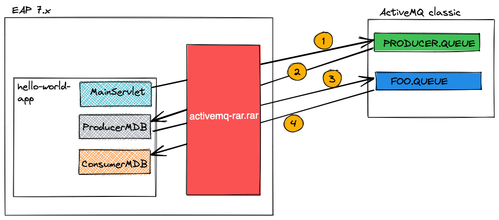

# ActiveMQ-Classic-with-EAP-example
Apache ActiveMQ classic setup with EAP 7.x

## What is demonstrated here?
2 queues have been used to demostrate the producer and consumer 
workflows. Intentionally used 2 queues just to show the configurations.

## How to run

1. Configure active mq classic version 5.16.3 locally
2. Start active mq classic broker
3. Clone this repository to your machine
4. Run `mvn clean install` in the cloned project directory
5. Copy the executable to EAP deployments directory
6. Start the EAP and visit the browser link -> http://localhost:8080/helloworld-mdb-37/
